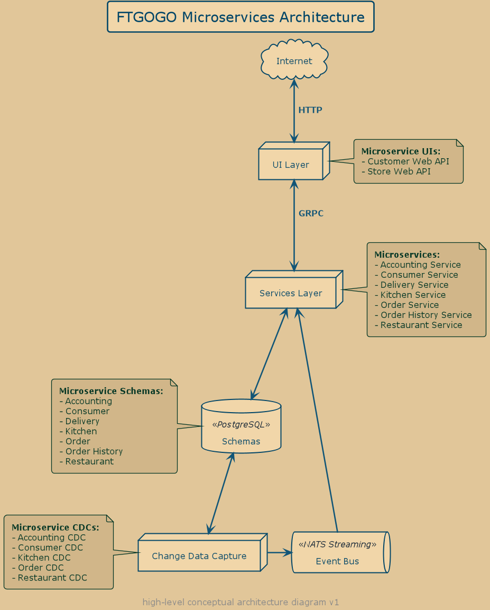
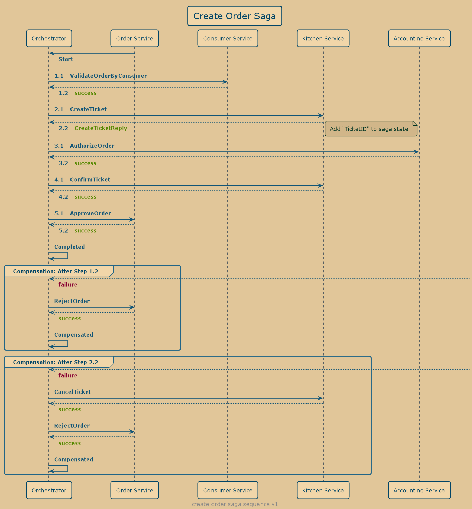
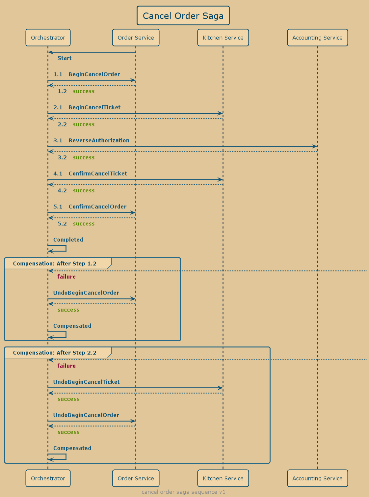

# ftgogo - event-driven architecture demonstration application

## Introduction

ftgogo (food-to-gogo) is a Golang implementation of
the [FTGO](https://github.com/microservices-patterns/ftgo-application) application described in the
book ["Microservice Patterns"](https://www.manning.com/books/microservices-patterns) by Chris Richardson. A
library [edat](https://github.com/stackus/edat) was developed to provide for Golang many of the solutions
that [Eventuate](https://eventuate.io/), the framework used by FTGO, provides for Java.

## Purpose

This repository exists to demonstrate the patterns and processes involved when constructing a distributed application
using event-driven architecture.

This repository started as a Golang clone of the FTGO demonstration application but as time goes on it will grow to
demonstrate additional microservice patterns and techniques.


## Prerequisites

[Docker](https://www.docker.com/) - Everything is built and run from a docker compose environment.

## Execution

Open a command prompt and then execute the following docker command

> NOTE: The first time you bring everything up the init script for Postgres will run automatically. The services will crash-loop for a bit because of that. Eventually things will stabilize.

### Mac and Linux Users

```bash
COMPOSE_DOCKER_CLI_BUILD=1 DOCKER_BUILDKIT=1 docker-compose up
```

### Windows Users

```shell
set "COMPOSE_DOCKER_CLI_BUILD=1" & set "DOCKER_BUILDKIT=1" & docker-compose up
```

Use `Ctrl-C` to stop all services.

### Running individual services

Not recommended but each service can be run using `go run .`. You'll need to use an `.env` file or set some environment
variables to properly run the service.

> Use `go run . --help` to see what flags and the list of environment variables that can be set.

## Application

### Services

- [accounting-service](https://github.com/stackus/ftgogo/blob/master/accounting/cmd/service) - the `Accounting Service`
- [consumer-service](https://github.com/stackus/ftgogo/blob/master/consumer/cmd/service) - the `Consumer Service`
- [delivery-service](https://github.com/stackus/ftgogo/blob/master/delivery/cmd/service) - the `Delivery Service`
- [kitchen-service](https://github.com/stackus/ftgogo/blob/master/kitchen/cmd/service) - the `Kitchen Service`
- [order-service](https://github.com/stackus/ftgogo/blob/master/order/cmd/service) - the `Order Service`
- [order-history-service](https://github.com/stackus/ftgogo/blob/master/order-history/cmd/service) -
  the `Order History Service`
- [restaurant-service](https://github.com/stackus/ftgogo/blob/master/restaurant/cmd/service) the `Restaurant Service`

Several services also have sibling CDC services.

### Design

- Services exist within a capability or domain folder. Within that folder you'll find the following layout.
  ```
  /"domain"        - A capability or domain that is a subdomain in the application domain
  |-/cmd           - Parent for servers, cli, and tools that are built using the code in this domain
  | |-/cdc         - CDC (Change Data Capture) server. If the service publishes messages it will also have this
  | |-/service     - Primary service for this capability
  |-/internal      - Use Golangs special treatment of "internal" to sequester our code from the other services
    |-/adapters    - "Driven Ports" and implementations.
    |-/application - CQRS parent folder. Processes under this will implement business rules and logic
    | |-/commands  - Application commands. Processes that apply some change to the subdomain
    | |-/queries   - Application queries. Processes that request information from the subdomain
    |-/domain      - The definitions and the domain rules and logic
    |-/handlers    - "Driver Ports" implementations
  ```

- Each "domain" uses go modules for dependency management and has a `go.mod` file just for it.
- The services use the following components from [edat](https://github.com/stackus/edat)
  - [edat/es](https://github.com/stackus/edat/blob/master/es) - implements event sourcing
  - [edat/msg](https://github.com/stackus/edat/blob/master/msg) - implements transactional messaging
  - [edat/sagas](https://github.com/stackus/edat/blob/master/sagas) - implements orchestrated sagas
- Application domain apis, events, commands, and entities are available to all subdomains from
  the [serviceapis](https://github.com/stackus/ftgogo/blob/master/serviceapis) folder and its child packages.

### DDD / Hexagonal Architecture / Ports & Adapters

The organizational layout of the services is to bring separation to the layers.
The `/"domain"/internal/application/service.go` file found in all the services is what is used to combine primary or "
Driver" adapters with secondary or "Driven" adapters.

- The application is connected to the `/internal/domain` using interfaces backed by real implementations found in
  the `/internal/adapters` folder.
- Commands and queries have no dependencies on any primary ports or to any infrastructure directly. In fact, they may
  only receive adapters that implement secondary ports defined by interfaces in the `/internal/adapters` folder.
- No dependencies exist on any ports or adapters from the code in `/internal/domain` and this is crucial to having a
  clean architecture.

> Regarding the layout. What I landed on felt alright to work with, felt like it provided the right separations, and felt like it wasn't an over complication of DDD applied to a folder structure. You be the judge.

### CQRS

Each service divides the requests it receives into commands and queries. Using a simple design
described [here](https://threedots.tech/post/basic-cqrs-in-go/) by [Three Dots Labs](https://threedotslabs.com/) all of
our handlers can be setup to use a command or query.

> While most application commands in this repository will adhere to the "commands return nothing" rule, some commands return simple scalar values, mostly entity ids, in addition to the error and I am OK with that.

### Event Sourcing

Several services use event sourcing and keep track of the changes to aggregates using commands and recorded events.
Check out the [Order](https://github.com/stackus/ftgogo/blob/master/order/internal/domain/order.go) aggregate for an
example.

### Sagas

The same three sagas found in [FTGO](https://github.com/microservices-patterns/ftgo-application) have been implemented
here in the [order-service](https://github.com/stackus/ftgogo/blob/master/order/cmd/service).

- [CreateOrderSaga](https://github.com/stackus/ftgogo/blob/master/order/internal/adapters/create_order_orchestration_saga.go) - saga
  responsible for the creation of a new order  
  
- [CancelOrderSaga](https://github.com/stackus/ftgogo/blob/master/order/internal/adapters/cancel_order_orchestration_saga.go) - saga
  responsible for the cancelling and releasing of order resources like tickets and accounting reserves  
  
- [ReviseOrderSaga](https://github.com/stackus/ftgogo/blob/master/order/internal/adapters/revise_order_orchestration_saga.go) - saga
  responsible for the processing the changes made to an open order  
  

### Event-driven architecture

All inter-service communication is handled asynchronously using messages.

#### Dual-Writes / Outbox / CDC

An implementation of the outbox pattern is included. It provides the solution to
the [dual write problem](https://thorben-janssen.com/dual-writes/). Any service that publishes messages is actually
publishing the message into the database. A CDC sibling service then processes the messages from the database and
publishes the message into NATS Streaming. This process provides at-least-once delivery.

> Services can be made to publish messages directly without having to use an outbox and CDC. The pattern works best, only?, with backends that provide transactional support.

### Backend-For-Frontend (BFF)

The project now demonstrates the backend-for-frontend pattern with the addition of a Customer-Web service. These types
of services are purpose built API Gateways that serve a specific client experience.

The addition of these BFFs also provide a place to implement cross-cutting concerns such as authorization and
authentication. I've tried to add demonstrations of the capabilities of what a BFF might do for a microservices
application.

#### GRPC and Protocol Buffers

With the addition of the first BFF all HTTP handlers were converted to GRPC. GRPC is a better choice for communication
between your applications Api Gateway or BFF. The contract for each service was left unchanged as much as possible with
the switch to GRPC.

### Other

#### Metrics/Instrumentation

Prometheus metrics for each service are available at `http://localhost:[port]/metrics`. The order-service has a few
additional counters. See the
order-service [application](https://github.com/stackus/ftgogo/blob/master/order/cmd/service/application.go) for more
information.

#### Mono-repository

This demonstration application is a mono-repository for the Golang services. I chose to use as few additional frameworks
as possible, so you'll find there is also quite a bit of shared code in packages under `/shared-go`

> `/shared-go` is named the way it is because I intended to build one of the services in another language. I didn't but left the name the way it was.

#### Always start with a Monolith

Before developing an application using microservices the strongly suggested advice is to start with a monolith. Whether
you have a legacy monolith application or are starting a new application the last step before microservices is to
refactor or design the monolith to be loosely-coupled.

The service capabilities can all be run together in a loosely-coupled monolith to demonstrate what that might look like.

#### Type Registration

Commands, Events, Snapshots, and other serializable entities and value objects are registered in groups in
each `/"domain"/internal/domain/register_types.go` and in the child packages of `serviceapis`. This type registration is
a feature of [edat/core](https://github.com/stackus/edat/blob/master/core) and is not unique to this application.

The purpose of doing this type registration is to avoid boilerplate marshalling and unmarshalling code for every struct.

## Changes from FTGO

I intend for this demonstration to exist as a faithful Golang recreation of the original. If a difference exists either
because of opinion or is necessary due of the particulars of Go, I will try my best to include them all here.

### Changed

- I've kept most API requests and responses the same "shape" but routes are prefixed with `/api` and use `snake_case`
  instead of `camelCase` for property names.
- In FTGO many apis and messages that operated on Tickets used the OrderID as the TicketID. I could have done the same
  but chose to let the Ticket aggregates use their own IDs. The TicketID was then included in responses and messages
  where it was needed.
- Order-History is not using DynamoDB. The purpose of Order-History is to provide a "view" or "query" service and it
  should demonstrate using infrastructure best suited for that purpose. For now, I'm using Postgres but intend to
  use [Elasticsearch](https://www.elastic.co/what-is/elasticsearch) soon.
- The `OrderService->createOrder` method I felt was doing too much.
  The [command](https://github.com/stackus/ftgogo/blob/master/order/internal/application/commands/create_order.go)
  implementation creates the order like before, but the published entity event that results from that command is now the
  catalyst for starting the CreateOrderSaga.

### Missing

- Tests. Examples of testing these services. Both Unit and Integration
- ~~Api-Gateway. I haven't gotten around to creating the gateway.~~ Backend-for-Frontends have been added.

## Out Of Scope

Just like the original the following are outside the scope of the demonstration.

- ~~Logins & Authentication~~ The Backend-for-Frontend has implemented this.
- ~~Accounts & Authorization~~ The Backend-for-Frontend has implemented this.
- AWS/Azure/GCP or any other cloud deployment instructions or scripts
- Tuning guidance
- CI/CD guidance
- Chaos testing - although feel free to terminate a service or cdc process for a bit and see if it breaks (it shouldn't)

## Quick Demo

[Postman](https://www.postman.com/) can be used to load the api collection for an easy demo.

With the application running using one of the commands above you can make the following calls to see the processes,
events, and entities involved.

- Consumer Service: Register Consumer
- Restaurant Service: Create Restaurant
- Order: Create Order

Loading `FTGOGO.postman_collection.json` into Postman will provide pre-built calls with semi-random data that can be
used to test the above.

## Contributing

Pull requests are welcome. For major changes, please open an issue first to discuss what you would like to change.

Please make sure to update tests as appropriate.

## No warranties

From time to time I expect to make improvements that may be breaking. I provide no expectation that local copies of this
demonstration application won't be broken after fetching any new commit(s). If it does fail to run; simply remove the
related docker volumes and re-run the demonstration.
